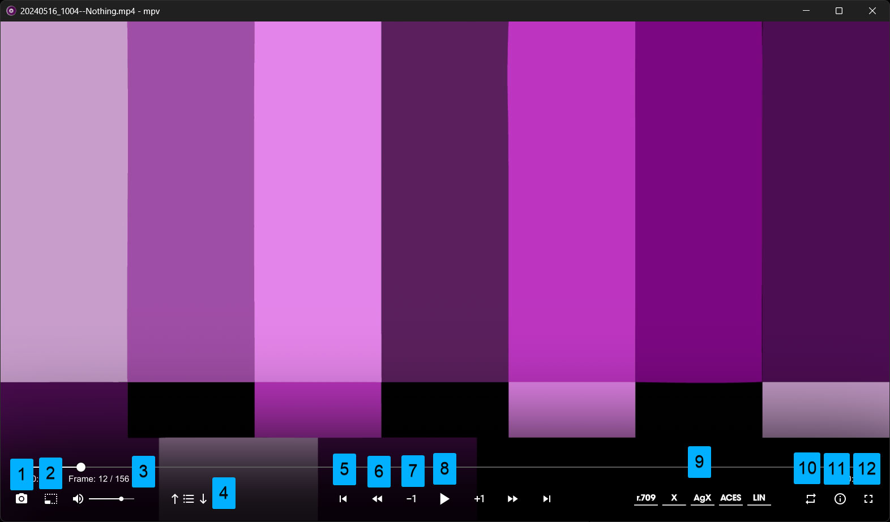

# mpv-union
 mpv setup and config for VFX


## Credits
 Included binaries and mpv plugins:

- https://github.com/ObserverOfTime/mpv-scripts/blob/master/clipshot.lua
- https://exiftool.org/
- https://ffmpeg.org/
- https://github.com/CogentRedTester/mpv-user-input
- https://github.com/tsl0922/mpv-menu-plugin
- https://github.com/maoiscat/mpv-osc-framework
- https://opencolorio.org/
- https://github.com/AcademySoftwareFoundation/OpenImageIO

## Install guide


### Manually

#### 1. Download and Install
- Download the latest *shinchiro* release: https://mpv.io/installation/

- Extract the package and move it to a `mpv' folder in a permanent location--anywhere is fine.  

- Right-click on `mpv/installer/mpv-install.bat` in your new mpv folder. Select *"Run as administrator"* from the Windows context menu. This helps register all the file types for your new player.

#### 2. Add mpv to your Windows Path.
 **IMPORTANT!** Don't skip this step. Many of the additional plugins and scripts require having **mpv's** location in your system path. *See notes at the end for more info.*

- Edit your environment variables


- Edit your system paths


- Add mpv to your system path and save. This will be the full directory path to the executable, but it does not include the executable itself.   


#### 3. Install plugins and extensions
 - Download the "mpv" folder above. In Windows Explorer, type in `%appdata%` and press enter. Alternately, browse to `C:\Users\Username\AppData\Roaming` where *Username* is your user name. 
 
 - If an 'mpv' folder does not already exist in this location, create one. If you already have one, delete its entire contents. 

 - Copy all the files from the downloaded `mpv` folder to the `mpv` folder in appdata. 

---
### Using Chocolatey (reccomended)
 Chocolatey is a package manager for Windows. The advantage of installing MPV this way is two-fold: (1) It will automatically add MPV to your path. (2) Updates are effortless.

#### 1. Install Chocolatey
 - Open an Admin Powershell window and paste the following. Press enter. When you're finished, it will ask you to enter two more lines. Do them one by one and press enter after copy-pasting each line individually. Don't forget this last step.

```
Set-ExecutionPolicy Bypass -Scope Process -Force; [System.Net.ServicePointManager]::SecurityProtocol = [System.Net.ServicePointManager]::SecurityProtocol -bor 3072; iex ((New-Object System.Net.WebClient).DownloadString('https://community.chocolatey.org/install.ps1'))
```

#### 2. Install mpv
 - In a new Admin CMD window, enter `choco install mpv` —press enter, then "y" or "a" when asked. 

#### 3. Install plugins and extensions
 - Download the "mpv" folder above. In Windows Explorer, type in `%appdata%` and press enter. Alternately, browse to `C:\Users\Username\AppData\Roaming` where *Username* is your user name. 
 
 - If an 'mpv' folder does not already exist in this location, create one. If you already have one, delete its entire contents. 

 - Copy all the files from the downloaded `mpv` folder to the `mpv` folder in appdata. 
 


## Find mpv...
  ...and pin to your tasbar or start menu.

- Press the Windows key on your keyboard,search for MPV, and click "Show Location." This will show you the location of mpv.exe. You can right-click on that executable and pin it to the start menu or taskbar. 

## Usage

### Player controls



1. Saves screenshot to clipboard
2. Toggles broadcast title/action safety guides
3. Estimated frame count - *See notes at the end*
4. Loads a folder to playlist + navigate up/down that list
5. Moves to beginning (end) of clip
6. Moves back (ahead) 1 second.
7. Moves back (ahead) 1 frame.
8. Play/Pause
9. Toggles playback color space `rec,709 to sRGB`, `No transforms`, `AgX to sRGB`, `ACEScg to sRGB`, `Linear sRGB/rec.709 to sRGB`
10. Loops file
11. Info
12. Full screen

### User-input is often needed


 - Many menu options require user input, such as image-sequence playback, video transcoding, and EXR-layer extraction. A dialog will appear in the bottom left corner of the window. Enter a selection from the menu or type out the requested data, then press enter. 

### Right-click menu - Social media title safety guides


### Right-click menu - Video extras


- **Find After Effects Project** - Looks for metadata in a video that points to a source After Effects project. If it finds the metadata, it will present options to reveal the project in Windows Explorer, open it in After Effects, or copy the file path to the clipboard. NOTE: Natively, this metadata is only written to certain file formats like Quicktime *.mov.

- **Find Premiere Project** - Same as above, but for Premiere.

- **Transcode options** - Transcodes an MP4 into the same folder as the source video. Provides options for common color space conversions. This transcoder will also look for After Effects metadata in the source file and copy it to the MP4 if it finds it. 

### Right-click menu - Image extras


- **Play Image Sequence** - Load one image from a sequence into the play and then click this button to play the whole sequence as a video. It will ask you for a framerate first. Type the framerate in as a response (numerals only like `24`, `25`, or `23.976`), then press enter to play the sequence. 

- **EXR Extract** — These menu options will extract a layer from a multi-layer EXR file as a proxy for previews. If the plugin sees an alpha channel in the layer, it will write a PNG sequence into a subdirectory in your render folder. It will write a JPG sequence into that subdirectory if it does not see an alpha channel. Once the extraction is complete, it will ask you for a framerate and play down that proxy sequence as a video. **Notes:** (A) Redshift doesn't save alpha data on AOVs and passes (it only saves alpha data on the main RGBA pass), so it will always extract JPGs. Only Octane and Cycles will output PNGs. (B) This plugin may not work as expected if you don't have clean render folders. It doesn't yet accommodate multiple sequences in the same folder. It's still a work-in-progress. (D) The proxy extraction outputs frames that are 1080px(with the width generating a value that respects the native aspect ratio). This resizing allows for frame-accurate animation review of larger 4k+ renders that may otherwise playback in real-time. 

- **Transcode to MP4** — This menu option functions like the video transcoding options but for image sequences. It works if you have loaded the whole sequence or only one image from that sequence. Before transcoding, the plugin will request a frame rate and a starting frame number. The starting frame number is essential for it to function as intended. Like the EXR extracting plugins, clean folder structures are needed--the plugin makes some assumptions about folder structure. It will render an MP4 to the sequence's parent folder so that it's not lost in a sequence folder. 


## Additional Notes

